# Smarter Home: Where Your Home Learns From You.

Authors: Wout Burgers, Levi Raktoe, Shreya Sebastian, Archita Selvam

---

## Introduction

The smart home market is rapidly expanding, with increasing demand for automation and energy efficiency (Technavio, 2023). From a user perspective, current systems often present two issues: users are unsure of what automations they truly want, and the learning curve for implementing these automations can be steep (Intille et al., 2019). At the same time, privacy and security concerns are large, as home data is inherently personal and sensitive. Additionally, regulatory frameworks such as the EU’s GDPR require strict safeguards around data use and storage (GDPR Advisor, 2023). The Smarter Home system will try to tackle this problem.

The goal of the Smarter Home is to make home automation transparent and accessible, especially for those with less technical expertise. The system aims to learn from how and when household devices are used. Also to identify patterns in this usage and suggest automations that align with the users’ daily routines. Each suggestion is shown with a clear explanation of the data it is based on, ensuring the transparency and the trust. The users retain full control over their information and can view or delete recorded data at any time. The interface is designed with simplicity and inclusivity in mind, ensuring that all users regardless of digital familiarity can comfortably manage and customize their home automations.

This report presents the development of the Smarter Home system. It begins by analysing the problem context and stakeholders, followed by the definition of functional requirements and key quality attributes that guided the design process. This is followed by a context analysis that examines the external factors influencing the system and a discussion of the ethical implications and mitigations. The report then outlines the system architecture, explains the chosen architectural development techniques and discusses key design decisions with alternatives. After this there is the comparison between cloud and on-premises deployment and an explanation of the considered open source components. Finally, it presents the proof of concept and evaluation, demonstrating how the proposed solution addresses the identified challenges and achieves the project’s goals of accessibility and transparency.

## Stakeholder Analysis

The proposed smart home system is designed to observe and learn the daily routines of household inhabitants. It is built with extensibility in mind, allowing integration with a wide range of sensors and devices to accommodate different household needs and user preferences. Understanding how these features affect the various people involved in and impacted by the system is critical as each group may have different expectations. To be able to design the system in such a way that maximizes benifts, it is essential to conduct a stakeholder analysis on the system. The results of the analysis are shown in the image below.

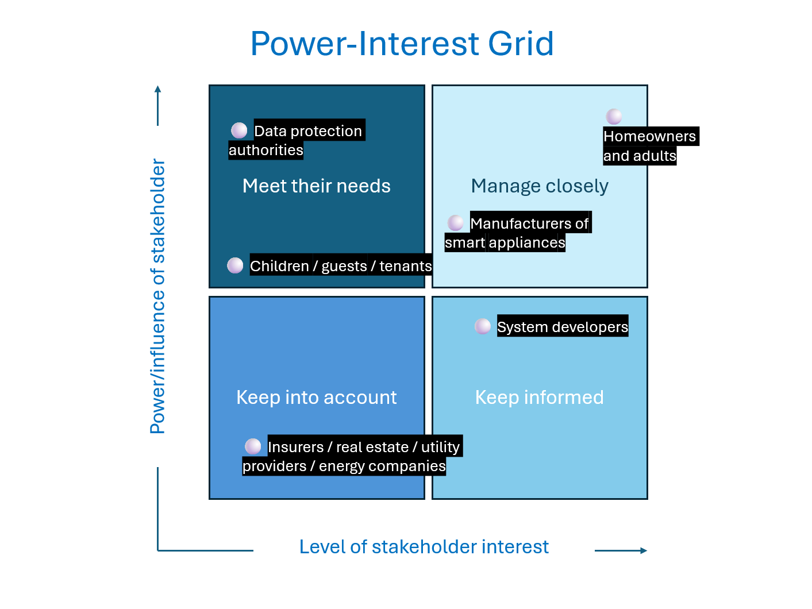

### High influence and high interest

The primary stakeholders are the homeowners and adult residents. These are the main users of the system and their interests are in the convenience, the comfort and the efficiency. They are the most likely to value a home that takes over the repetitive tasks. These tasks could include actions such as switching off lights and locking doors, and also adjusting thermostats. Many people will like the potential for energy savings and the cost reductions. However this group is also the most vulnerable to concerns over their privacy. The system records routines, and it could reveal sensitive information about when people are just at home. But also when they sleep or when they leave the house. If this is not handled correctly such data could become a security risk. Furthermore some users may fear losing control over their home environment if the system over-automates or offers any suggestions that might feel intrusive. Their experience will determine in the end whether the system is accepted and whether it can be integrated into the everyday life. As seen in the diagram, this group has both high influence and high interest. This means they must be closely managed to ensure the system meets their needs and earns their trust. 

Next in the diagram we also see the manufacturers of smart appliances and sensors who represent another stakeholder group. Active engagement with the manufacturers is needed to align with their goals. Their interest lies in ensuring that their products integrate seamlessly with the proposed system. This can also then boost the sales of the smart home products. At the same time, some manufacturers may fear that they are being overshadowed or locked out if the system privileges for certain brands. Whether the system uses open standards and API’s, will also determine the reach of the system and the amount of systems and homes that are able to use the system.

### High influence and low interest

Secondary users, such as children guests or tenants are less involved in the decision making but are still important to the system. They have high influence as they require user interfaces that are safe and simple. The access should also be restricted to only those parts of the home relevant to them. For example, a child should be able to control the lights in their own bedroom but they should not the household heating system. Guests or temporary tenants may like the convenience of automated living. But it could also feel uneasy about being monitored if they are being inside someone else their smart home. This system negatively impact the overall satisfaction of their stay. 

Data protection authorities are also implicated. Given that the system collects sensitive personal data about household routines, it will have to comply with the regulations. Therefore they will have a high influence on the overall system. These are regulations such as the General Data Protection Regulation in Europe or the California Consumer Privacy Act in the United States.

### Low influence and high interest

Another import group of stakeholders to think about consists of the system developers and technology providers. Their role is to ensure the technical robustness of the platform. Particularly in integrating the sensors and devices from different brands. They also carry responsibility for designing the machine learning models that detect the user routines. Developers should go for a balance between personalization and privacy. Also compatibility with existing platforms such as Google Home, Amazon Alexa or Apple HomeKit will be essential to make the system a success. As the platforms are already in the market, they will have high interest to engage in a way that allows them to grow and to be integrated. 

### Low influence and low interest

Finally, low influence and low interest stakeholders can include the utility providers and the energy companies, who may see some opportunities in collaboration with the system. For example data on energy consumption could reduce the environmental impact of the household. Similarly insurers and real estate stakeholders are interested because smart homes can reduce risks such as fire or flooding. This can increase the value of the home. Although they have low influence and interest, it is still important to keep this group in mind.

---

Throughout these stakeholders, there exist potential conflicts. Personalization and privacy are a difficult topic. Residents might want intelligent and customized automation, but data protection authorities require tight restrictions to look after personal data. Developers may want the open interoperability, but competitors resist sharing their technologies to protect the business space.

In conclusion, the smart home system has significant potential to make automation available to mass consumers on a more affordable basis through reduced learning needs and smart recommendations. Its stakeholders are homeowners and residents, but also developers, manufacturers, regulators and even insurers. Each group has its own interests and frictions and through well designed transparency and stakeholder engagement, the system can provide benefit to all of the people that are related to it.

## Domain model

The model in the figure below shows the most important objects and relationships of the domain. The user is central to this system. They have some degree of control over most other objects in the system, as we want to emphasize user control. The only object the user does not access of its own accord is the Automation Suggestion System, which can only make suggestions to the user.

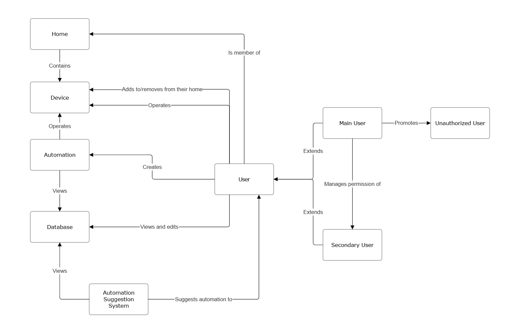

## Functional requirements

The Smarter Home system is designed to create an intelligent and user friendly environment by using automation. The detailed functional requirements for this system are provided in [Appendix A](../appendix/team_20_appendix.md). This section summarizes the core functionalities and shows their operation through example user scenarios.

### Overview

The Smarter Home allows a main user to manage access, configure devices and create automations based on generated suggestions. Devices record operational data and this is then is analyzed to detect user routines. Users can review and accept or reject these suggestions still maintaining full control over their smart environment.

### Scenarios

The following scenarios illustrate how the Smarter Home system identifies user behavior patterns and generates useful automation suggestions to improve convenience and efficiency.

1. The system notices that lights that are turned on by 7:00 PM are dimmed to a lower intensity. The system notifies the user of a detected routine, and suggests an automation that reduces the intensity of each light that is on by 7:00 PM. The user reviews this suggestion and enables the automation. 

2. The system notices that the heating is turned down after the door opens and closes in the morning. The system is suggests an automation that reduces the heat after the door is opened and closed. The user alters this automation to make sure this only happens before 10:00 AM. After the change the automation is enabled.

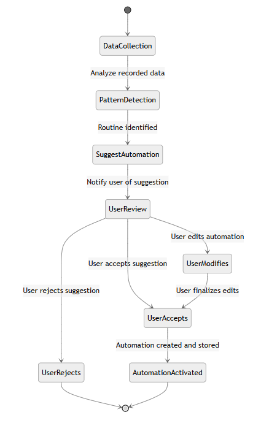

This state diagram shows the flow of the Smarter Home system when identifying and implementing an automation suggestion. It shows how the system collects device data detects, user behavior and generates a corresponding automation proposal. Once the user reviews and enables the automation, it becomes active and executes automatically according to the detected routine. This process reflects the scenarios described above, where the system learns from repeated actions, such as dimming lights at 7:00 PM and transforms them into smart user-approved automations that enhance convenience and efficiency of their home.

## Context Analysis

A thorough context analysis is essential to understand the factors influencing the **“Smarter Home System”** project and to identify areas that must be managed for successful implementation.

### External Risks and Dependencies

**Hardware and Sensors**  
The system's overall performance depends on the functioning of various smart home devices, like motion sensors, smart lights, thermostats and other IoT devices. Sensor defects can cause data loss which in turn can affect the system’s ability to learn routines and suggest properly informed automations. For example, a defective motion sensor may not register the user's presence which could lead to an automation incorrectly turning off the lights while the user is still present in the room. 

**Cloud Services and Connectivity**  
Several features of the system such as behaviour learning, routine suggestions, and remote access, depend on stable internet connectivity. Outages or latency issues can reduce the system's reliability and consequently user satisfaction (Moldstud, 2023). An internet outage not only temporarily prevents remote access for the user but also creates a data gap. Constant data loss can affect the system's learning of the user's routine behaviour.

**Software Integration**  
The system must integrate seamlessly with multiple smart home platforms like Google Home and Amazon Alexa. It must also be compatible with wireless technologies like Zigbee, Z-Wave, or Wi-Fi. Interoperability is essential for ensuring security of the sytem which positively influences consumer trust. Poor integration can cause compatibility issues and increased cybersecurity risks (OECD, 2018).

**Machine Learning and Data Analytics**  
AI-driven suggestions rely on machine learning algorithms that can accurately recognize patterns in user behavior and generate informed automations. This requires continuous access to validated data from user interactions and connected devices. Incorrect assumptions made by the system about user routines could lead to frustration and disengagement (Fischer et al.).  For example, the system could misinterpret one-time events like parties as a new daily routine and begin inconveniently suggesting late-night lighting. The system is therefore dependent on its ability to distinguish between actual patterns and exceptions to provide genuinely helpful automations.

**Maintenance and Updates**  
Continuous updates are essential for maintaining security and performance over time. Structured maintenance plans help prevent devices from becoming obsolete or vulnerable once manufacturer support ends (OECD, 2018). The evolving nature of data protection laws and smart home standards requires the system to adapt continuously (Alshammari and Simpson). Failure to adhere to changing standards could cause elements of our system to become unresponsive, breaking already established user routines. 

**Regulatory Compliance**  
Compliance with data protection and privacy regulations like the GDPR is essential. The system depends on legal frameworks for data storage, data processing, and user consent, which must be continually monitored as regulations change (Office of the Victorian Information Commissioner, 2023). A change in legislation, such as an algorithmic explanation becoming mandatory, could then require significant revising of the system's data learning architecture to remain compliant. 

**User Engagement and Feedback**  
The system’s AI requires ongoing user interactions to refine its suggestions and adapt to individual preferences. Adoption and sustained engagement depend on intuitive interfaces and user trust (Zigpoll, 2023). If the system is overly complex or fails to establish trust, potential users may hesitate to engage with it (Fischer et al.). The system's AI requires continuous user interaction to refine its understanding of their preferences. It depends on users actively confirming, rejecting, or modifying the automations it suggests. If the interface for providing feedback is inconvenient, users may become passive. The user may also expect the generated suggestions to come with explanations of why that suggestion is being proposed to the user. This addition of explanations help users understand how the system operates better, increasing overall trust in the system. 

To summarize these dependencies, the context diagram below illustrates the system's relationship with external entities:

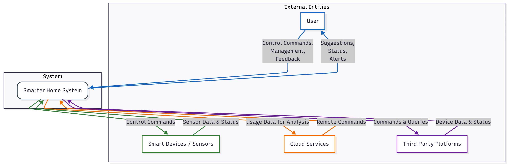

## Ethical Implications and Mitigations

Although smart homes offer significant benefits in convenience and efficiency, they also introduce critical ethical issues regarding how user data is stored and used. This project will address several of the key privacy and security concerns that arise from the use of smart home technology.

A major ethical concern posed by smart homes is privacy. The fundamental operative principle behind our smart home system is analyzing user data to identify patterns of user behavior and suggest automations for their routines. However, this would automatically involve constantly monitoring and recording user data, and potentially exposing this data to third-party companies that are integrated into the system. Since this data has to be stored, it could become the target for potential misuse if compromised. Sensitive personal data could be used to target the user for profiling, advertising or manipulation. As smart homes are vulnerable and prone to hacking, the user's lack of awareness of cybersecurity practices often lead to smart homes being exposed to potential threats. 

Therefore the software architecture has to build preemptive solutions into the smart home system to combat this. One possible solution could be having sensitive data stored and processed locally rather than in cloud. In this model, the cloud's role could be limited to non-sensitive tasks like providing software updates or facilitating remote access via end-to-end encrypted commands, rather than acting as a repository for user data. It is also essential to collect only mandatory data for functionality to maintain user trust. Another solution is encrypting sensitive data during transit and rest. Sensitive data can be stored in separate databases in local hubs. The system can also be implemented using role-based access control where each microservice accesses only what it needs. Security protocols can also be used when handling data. Another measure that can be taken is using the daily device usage blueprint to track any irregular practices to identify a third-party and alerting the user. 

Another ethical concern posed by smart homes is subtle and not as overt as the security issues. This is related to the long-term physical and psychological impact of smart homes on the user. Living in smart homes could lead to a gradual reduction of control if the system does not rely on user input. This can best be addressed by providing the user with the choice to automate a task. The user can make an informed decision rather than being subconsciously going along with automations implemented by the system. The user can also have the choice to de-automate any task at any time. The system can be made consultative and interactive to inform the user of potential risks and provide agency to the user to make the final decision regarding permitting the automation.

## Key Quality Attributes

The following quality attributes define the non-functional requirements of the Smarter Home system.

- **Privacy**: Recorded data is not immediately sensitive but should still be unavailable outside the system. Full transparency on what data is recorded.

- **Correctness**: The system recommends useful automations. An automation is useful when it operates devices in a way a user already does manually, or in a way a user would, given the choice.

- **Usability**: One of the goals of the Smarter Home is to be as accessible as possible. To achieve this goal, user interfaces must be simple and intuitive. Recommendations must show what information they're based on, so that the system can be trusted by technical and non-technical people alike.

- **Security**: Only authenticated users and devices should be able to access the system to view its recorded data or operate its devices. This is a key concern for smart home systems in general because of two reasons: First, this is because the risk involved: the loss of privacy or the loss of control over the devices in ones own home. Second, smart home systems are more vulnerable to cyberattacks due to their distributed, heterogeneous nature: all devices must be secure, otherwise they may form a gateway to the rest of the system. Additionally, the system is always active all the time and therefore always a possible target.

- **Availability**: The availability of any connected device must depend only on that device. This means that the failure of any device must not cause any other device to become inoperable.

- **Extensibility**: New types of sensors enter the market all the time. On a longer timescale, these devices may provide new types of data. To make sure our system can continue to offer accurate automation recommendations, our system must be readily extensible to support new devices and types of data.

- **Scalability**: This attribute is has two parts: First, as new devices enter the market, any home will need to support an increasing amount of them. Second, Any cloud functionality will need to be able to scale well with an increasing number of clients.

#### Privacy vs. Correctness

Privacy is a main concern with smart home systems, due to the large amounts of data IoT sensors collect inside users' homes. This data might not be immediately sensitive, but can present security concerns in aggregate. The routines can only be accurately identified based on accurate data, and privacy is therefore a direct tradeoff with the correctness of the system. By being completely transparent about the data collected, and allowing the user to inspect this data, they are empowered to make a more informed decision about the data they want recorded and or stored.

#### Security vs. Extensibility

As every device connected to the system is an avenue for attack, constraints need to be placed on what devices may access the Smarter Home. This means that devices may enter the market that cannot be supported without compromising security. To make sure our goals regarding security and thereby privacy and availability are met we can only allow connections with devices that are considered secure.

## Pricing model

The Smarter Home allows a greater part of the population to make use of all the useful features smart home systems already offer. Therefore, we plan to partner with existing smart home device manufacturers to integrate their products with our system, making them more accessible, leading more customers to these companies. These deals would finance Smarter Home.

# 2. System Architecture

>TODO INTRODUCE THIS SECTION

## 2.1 Local vs. Cloud Responsibilities
<!-- TODO link section requirements -->
As detailed in the previous section, the Smarter Home system must preserve user privacy, be accessible remotely, and be useable by non-technical users. These goals are at odds with each other, as remote access implies some kind of networked service, while preserving privacy calls for local control of sensitive data. Finally, usability to the layman suggests that any solution to this tension be solved outside the users' view.

### Options considered
<!-- TODO Should this be a table?-->
1. Local-only architecture
    - All data and control remain inside the users' home.
    - Pros: Privacy is best protected.
    - Cons: Remote access is not straightforward; far less useable for non-technical users.
2. Cloud-centric architecture
    - Processing and storage happens in the cloud. 
    - Pros: Remote access is more straightforward, centralized management, <!-- TODO reference cloud section? -->
    - Cons: Sensitive data outside user control; offline operation impossible.
3. Hybrid architecture
    - Combines a local and a cloud component.
    - Pros: Remote access can be achieved through the cloud component while sensitive data can remain local.
    - Cons: Additional complexity; reliance on local hardware.

### Y-statement
> In the context of enabling remote smart-home control while preserving privacy and ensuring ease of use, facing the challenge that cloud services simplify remote connectivity for the user but inherently risk exposure of personal data, we decided to divide the system into a local component handling all sensitive data and a cloud component providing remote access, to achieve strong privacy, remote access and user-friendly operation, accepting increased system complexity and dependency on local hardware for critical functionality.

## 2.2 Architectural styles

Now that we have decided that our system will feature a cloud component and a local component we will discuss several architectural styles. We will focus on the attributes most relevant for the structural architecture of the system: security, availability, extensibility and scalability. The other qualities remain highly important but are addressed through design and implementation decisions rather than architectural structure.

### Monolithic Architecture

In a monolithic architecture, the whole system is built as a single deployable unit. The logic runs in a single process and the application may be modularized by simply using features of the programming language, but in general, remains tightly coupled. Development for monolithic architectures is relatively simple. They are constructed with one codebase, making them easier to build. Testing the system as as whole is also easier, as the whole of the system could be run from a single instance. Deployment is also simplified as the system works with a single executable or directory. Data is processed inside a closed system, leaving few surfaces exposed to cyberattacks.

However, this simplicity also makes the architecture rigid, with comes with a large drawback: the system becomes resistant to change. Even though building the system was simpler, going back and making changes is more difficult. This is because the system is more tightly coupled, and changes at one point may affect larger parts of the system. On top of that, any change requires a complete redeployment. To make sure developers do not spend all of their time rebuilding, any decisions must be made more carefully and require longer-term commitment. In particular, scalability is a large challenge for monolithic architectures. Lastly, availability is limited, because the entire system becomes unavailable if the instance fails. (Powell & Smalley; Ponce et al. 2019).

### Layered N-tier Architecture

In an N-tier architecture the system is divided into horizontal layers. Each layer performs a specific role within the application. Most standard layered architectures consist of four layers: presentation, business, persistence, and database. However, larger applications may have more layers, and smaller applications may have less. The main advantage of this architecture is the decoupling of the layers. This makes it easier to develop and maintain due to the limited scope of components. Furthermore, testing is simplified because other layers can easily be mocked. Layers may be considered open or closed. An open layer allows a request to skip that particular layer, while a closed layer mandates that that request passes through itself. Opening layers reduces overhead, but too many open layers make for a tightly coupled system, negating the decoupling advantage. As the layers are generally not independently deployable, scalability and availability is similar to the monolithic architecture.  (Richards, 2015).

### Microkernel Architecture

In a microkernel architecture, the system consists of a core component which provides base functionality and plug-ins which provide extended functionality. Plug-ins are independent from each other, and connect only to the core through a plug-in interface. Additionally, plug-ins should only depend on the plug-in interface and the data returned through that interface. It is this loose coupling that makes plug-ins easier to modify and test than one part of a monolithic architecture would be. Adding new plug-ins is simple for the same reason. The plug-in interface is standardized, so that the core does not need to know anything about any plug-ins specific implementation. This isolation also enhances security and availability through clearer information boundaries and fault containment respectively. Microkernel architectures are deployed similarly to a monolith, which has the advantage that internal communication remains fast. However, similarly to monolithic architectures, changes to the core and plugins related to important functions require a complete redeployment. (Thomas, 2025).

### Microservice Architecture

In a microservice architecture, the system is split into "independently deployable, loosely coupled, components, a.k.a. services."(Richardson) Each service runs in its own process and is responsible for its own subdomain. This division makes a microservice architecture extremely friendly to change. Individual components can be updated, tested and deployed without intruding on the functionality of others, allowing continuous delivery. Furthermore, when a single service fails, the other service may stay running.

However, when looking at the system as a whole, microservices do introduce complexity, mainly in the communication between services. There are increased security risks, because data is now processed over multiple services potentially opening up more avenues to attack (Powell & Smalley).

### Trade-off analysis

Having discussed each architectural style, we continue with a summarizing trade-off analysis. The table below shows a comparison between the styles with regards to the chosen quality attributes.

| **Architecture** | **Security** |	**Availability** | **Extensibility** | **Scalability** |
| ---------------- | ------------ | ---------------- | ----------------- | --------------- |
| Monolithic       | High         |	Medium	         | Low               | Low             |
| Layered N-tier   | High         |	Medium           | Medium            | Low             |
| Microkernel      | High         |	High             | High              | Medium          |
| Microservices    | Medium       |	High             | High              | High            |

The monolithic and layered approaches provide simplicity and security, but their limited extensibility make them unsuitable for the evolving smart home market. We adopted the microkernel architecture for the part of our system that lives inside the home. There, on a central hub, it can be deployed as a single unit. The modularity of the plug-ins allow the extensibility to adapt to changing technology in the IoT device landscape. For the part of our system that lives in the cloud, we choose a microservices architecture, as it excels in availability, scalability, and extensibility which are essential for functional requirements like remote access and potential integration with external services. 
In conclusion, we choose a hybrid approach: a microkernel architecture for the local hub, and a microservices architecture for the cloud component.

### Y-statement

> In the context of choosing an architectural style for our system that deals with sensitive data locally, must remain accessible at all times, and must be adaptable to the changing landscape of IoT devices, facing the challenge that architectures that emphasize security often are at odds with those emphasizing extensibility and scalability, we decided to adopt a microkernel architecture for the local hub and a microservices architecture for the cloud component, to achieve security, availability, extensibility and scalability, accepting increased system complexity and the need for careful security mitigations in the cloud.

## 2.3 C4 Software Architecture Views

> TODO section introduction

### 2.3.1 Context View

The context view covers defines the relationship between Smarter home system and external parties or systems. It shows the interactions between users, devices and third-party platforms with the system when it operates.

The diagram identifies three external actors and one main system:

1. User - The primary external actor who interacts with the system through web UI or mobile to monitor or control devices, manage preferences and view data insights.
2. Smarter Home System - It is composed of several internal containers (Local Hub, Cloud Services and connected Devices).
3. Local Hub - It's an edge node inside the home network which communicates with IoT devices abd sensors directly.
4. Devices/Sensors - They are physical IoT devices that generate data and receive commands.
5. Third-party Platforms - They are external agencies which connect through APIs.

#### Interactions

1. The user interacts with the system through app/UI.
2. Devices send sensor data to Local Hubs.
3. Local Hubs sync data with the Cloud for analytics and automation.
4. The system uses integration APIs to communicate with third-party smart home systems.

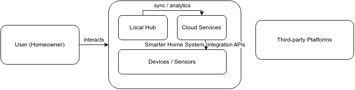

### 2.3.2 Container view

In this section we show the different containers that make up the Smarter Home system. Previously we discussed that the system would consist of a cloud and a local component. Below is a diagram showing the different microservices of the cloud component, and the different plugins of the local hub.

Users operate their home through a mobile application. This application communicates directly with the local hub when they are on the same network, but interacts through a the cloud in cases of remote access. Additionally, the cloud is responsible for delivering updates and patches, pushing notifications to the user and providing identity for external ecosystems like via OAuth 2.0 account linking.

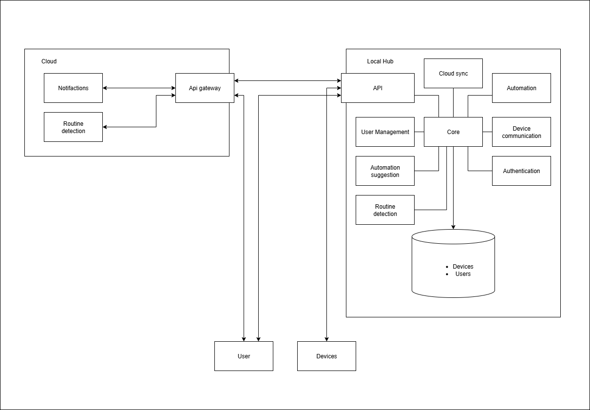

#### Cloud building blocks:

<!-- TODO mention discovery pattern -->

| **Building block** | **Description** |
| ------------------ | --------------- |
| API gateway | Entry point for all requests to the cloud and can forward requests to the local hub (Richardson). |
| Remote Access service | Manages connections between the cloud and local hub. Authenticates these connections via the authentication service. |
| Notification service | Responsible for notifying the user directly on their mobile device. |
| System Management service | Responsible for delivering updates and patches to the local hub. |
| Authentication service | Manages credentials for users, hubs and third-party integrations. | 
| Databases | The authentication, system management, and notification services each have their own database, ensuring data ownership and minimizing coupling. |

#### Local hub building blocks:

| **Building block** | **Description** |
| ------------------ | --------------- |
| Core | Core of the microkernel architecture of the local hub. Coordinates communication between plug-ins through a standardized interface that each plug-in must implement. |
| Automation | Runs configured automations. |
| Device communication | Responsible for building and interpreting requests to and from smart home devices. |
| Authentication | Makes sure only authenticated users can interact with the Smarter Home. |
| Automation suggestion | Interprets detected routine to suggest automations to the user. |
| User Management | Manages authentication levels of all users of the Smarter Home. |
| Network Module | Entry point for all requests to the local hub. |
| Database | Holds information on the connected devices, users of the Smarter Home, configured automations and sensor data before it is moved to cloud storage. |

### 2.3.3 Component View

Decomposing further, the figures below showcases the subdomains within the microservices and plugins. The subdomains serve as a skeleton for the structure of the codebase. 

#### Cloud

In the figure below we see the microservices in more detail. 

<!-- TODO briefly explain components (or not, see example om brightspace)-->

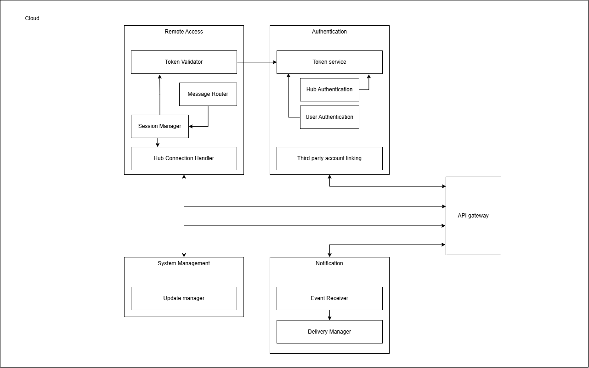

#### Local Hub

<!-- TODO briefly explain components -->

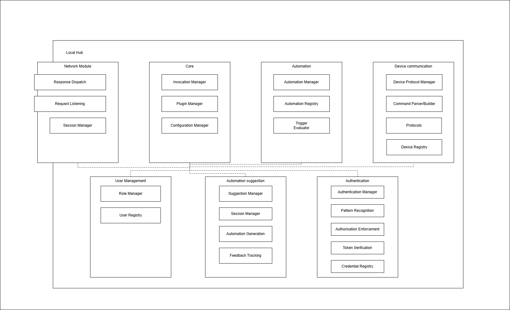

### 2.3.4 Class View 

The Class view depicts the internal code structure. It focuses on logical organization rather than runtime behaviour. This view is focused on the entirety of the Smarter home system and isn't limted to the PoC of the assignment which focuses on particular functionalities.

1. User - It represents the system user. Includes authentication, roles, permissions.
2. Device - It models a virtual IoT device with state and control methods.
3. Event - It represents data captured from devices.
4. AutomationSuggestion - It is used to automatically generate suggestions based on detected routines.
5. RoutineDetector - Processes events to learn user behaviour patterns and generate automation triggers.
6. Repository - Handles persistence like saving, querying and loading data.

#### Relationships

1. User -> Device: Users control and manage devices.
2. Device -> Event: Devices generate events logged by system.
3. Event -> RoutineDetector: Event data feeds into pattern-learning algorithm.
4. RoutineDetector -> AutomationSuggestion: Detected routines lead to automation suggestions.

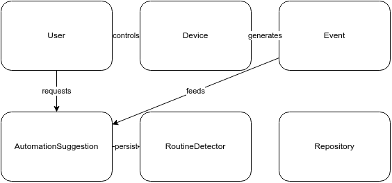

## 2.4 Runtime view

In this section we discuss a runtime view illustrating how the cloud and local hub work together to connect the user to their home. The diagram below shows the interactions between the local hub,the cloud and their plug-ins and microservices, when the user wants to update a device. For example, updating a device could mean turning a light on or off.

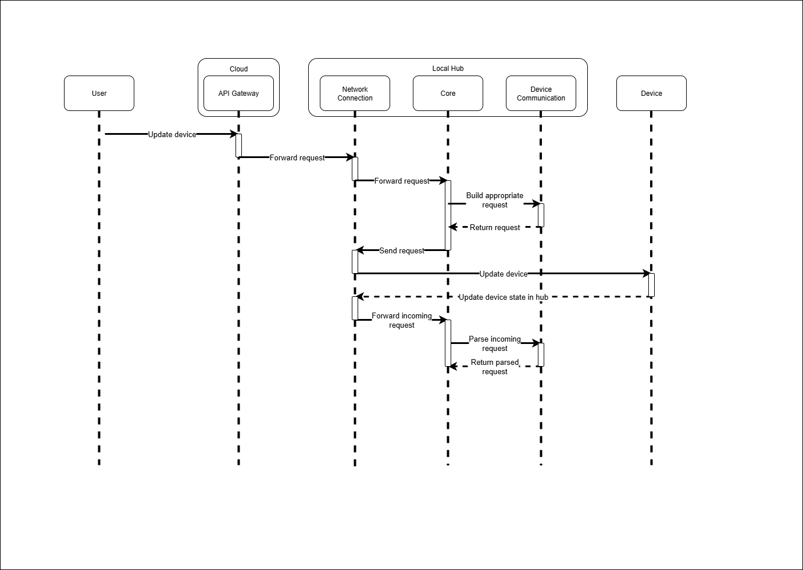

In this diagram, the cloud connects the user to the local hub, allowing the user to make requests remotely. The request is forwarded to the network module on the local hub. The network module passes this request to the core of the hub, as no plug-ins interact with each other. To interact with the device the hub needs to build a request adhering to the protocol used by the device. To do this, the core uses the device communication plug-in to build the appropriate request. This request is passed to the network module which sends it to the device. The device then returns a message to the hub, which is passed through the network module to the core. The core then uses the device communication plug-in again to parse the response, and can then update the database.

## 2.5 Selecting Open Source Components

The Smarter Home system can and should benefit greatly from existing open-source technologies, which offer a solid foundation for building the reliable and flexible smart home solutions. Open-source tools have multiple advantages such as being well-tested, widely supported and that they are freely available. This is making them an ideal choice for a project as ours that values transparency and adaptability. By combining different open-source components, the system can cover everything from the data collection and storage to the automations and user interaction without reinventing the wheel again.

Other applications frequently use frameworks like Flask, Django, and FastAPI to manage the data flow from the devices. They offer incredibly effective methods for controlling requests and communication between the system and the devices it is connected to. FastAPI's speed and integrated validation features are well-known. It is therefore beneficial for handling vast volumes of sensor data. Smaller services that require integrated database and user management tools are better suited for Flask and Django. FastAPI is the best framework for the Smarter Home project because of its balance of scalability and performance.

For communication between the different parts of the system, message brokers such as RabbitMQ, Apache Kafka and Redis Streams are relevant tools. These are tools that allow for the data to move smoothly between services without overloading the system. RabbitMQ is often used for reliable message delivery, Kafka for handling large data streams and Redis Streams for smaller real time tasks. In this case RabbitMQ will fit the project the best.

When it comes to storing the data, we can think of databases like PostgreSQL, MongoDB and InfluxDB which each offer different strengths. PostgreSQL is a strong option for structured and relational data. And especially when paired with TimescaleDB for managing time series data like temperature or motion readings. MongoDB is more flexible for unstructured data. InfluxDB is designed specifically for high frequency sensor input. The right choice depends on how the system balances between the consistency and the flexibility. For its reliability and compatibility with time series extensions PostgreSQL with TimescaleDB is the best option.

Next, the system should recognize user patterns and suggest automations. We can use machine learning libraries such as scikit-learn, pandas, and NumPy which already provide a practical foundation. They already support features such data analysis and model building in a transparent way. This helps users understand how the system reaches its conclusions. More advanced frameworks like TensorFlow or PyTorch could be explored later if the system needs deeper learning capabilities. But simpler approaches are often more interpretable and efficient for everyday use. And therefore in this context scikit-learn stands out as the best fit for developing explainable and lightweight automation models.

For device compatibility, open source platforms like Home Assistant, OpenHAB and Node-RED already support a wide range of smart home devices. Home Assistant has a large community and is easy to extend with Python. OpenHAB focuses on modularity and long term stability. Node-RED adds a visual layer that helps users create automation flows without coding, making smart homes more accessible. When comparing the different options, we think Home Assistant is the most suitable, because of its active development and extensive device support.

A good user experience is also essential. For this we need front end frameworks like React or Vue.js. These can be used to build responsive web interfaces where users can control their devices and view the system data. React is very popular for its flexibility and its large ecosystem. On the other hand Vue.js offers a more simple approach that suits smaller applications. Considering its maturity and strong community support and also the experience from our group with React, React is the best choice in our case for building the dynamic and user friendly interface.

The security and the privacy are central to any smart home system. Open source tools such as Keycloak and ORY Hydra can handle secure authentication and role based access. This will ensure that only authorized users can view or modify sensitive information which is crucial for our Smart Home system. Additional tools like Let’s Encrypt and OpenSSL can help safeguard communication and credentials through encryption. Among these Keycloak stands out as the most fitting solution thanks to its flexibility and straightforward integration with our other system components.

For deployment and maintenance, Docker offers a straightforward and reliable way. Docker will package and run each part of the system in its own isolated environment. This ensures that the different components of the system work consistently across setups and are easy to update or replace when needed. Its lightweight nature also makes development and testing more efficient. This allows the system to stay modular and stable as it grows. Given these advantages, Docker is the clear choice for managing deployment in our Smarter Home project.

## 2.6 Cloud vs on Premises Development 

There are several potential options for deployment models all with their own trade-offs. For instance, a fully private cloud model would provide benefits such as full sovereignty which in turn provides oppurtunites to ensure complete privacy of the user's data. However, a private cloud model in our case would be very difficult to scale as that would require the homeowner to upgrade their own hardware. 

For a public cloud model, the problem of scalability is solved as it makes use of a provider that is wholy dedicated to scaling. The problems of sovereignty and user privacy still persist as this model forces all sensitive user data to reside on third-party servers. 

A Hybrid approach would be ideal as real-time tasks can be handeled locally and less sensitive/heavier computation can be handeled on the cloud. In this manner, high sovereignty and user privacy can be maintained while still benefitting from public cloud services.

# 3 Proof of Concept

The **Smarter Home PoC** is a functional prototype demonstrating a robust and reliable architecture for ingesting data from IoT sensors. It specifically simulates a real-world environment where network connectivity can be intermittent, proving that data can be collected without loss, even under unstable conditions. It also tackles the problem of scalability with the use of a decoupled architecture. 

### Problems Addressed

The PoC directly addresses two fundamental challenges in IoT systems:

1. **Data Loss During Network Outages**  
   In a typical IoT setup, sensors send data to a central server over a network (like Wi-Fi or cellular). If this network connection is lost, a sensor would fail to send its readings, resulting in permanent data loss.

2. **Lack of Modularity**  
   A simple architecture might have sensors sending data directly to a service that also processes it immediately. This tight coupling means that if the processing service is slow, under heavy load, or temporarily down, the entire ingestion process halts, and sensors can no longer send their data.

### Architectural Solution

The PoC architecture is as follows:

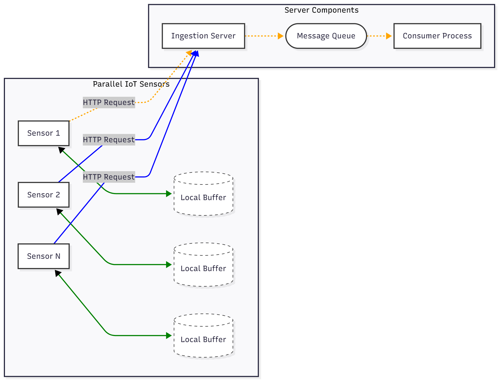

To solve the key problems mentioned, the PoC employs several architectural decisions:

#### 1. Tackling the problem of Data Integrity

- **Store and Forward Mechanism**  
  Sensors are designed to buffer data to a local file if they cannot connect to the ingestion server. This prevents data loss during network outages by storing it locally and forwarding it once the connection is re-established.

- **Durable Message Queue**  
  The use of RabbitMQ as a message broker decouples the ingestion server from the consumer. The queue is configured to be durable, meaning that even if the message broker restarts, the queue and its messages persist, preventing data loss at the broker level.

- **Persistent Messages**  
  Messages are published to the queue with a persistent delivery mode. This ensures that messages written to the queue are saved to disk and will survive a broker restart.

- **Consumer Acknowledgments**  
  The consumer sends an explicit acknowledgment to the message broker only after it has successfully processed a message. If the consumer crashes before sending this acknowledgment, the broker re-queues the message to be processed again, ensuring no data is lost during consumer failures.

- **Data Validation at Entry**  
  The ingestion server uses **Pydantic models** to validate the structure and data types of all incoming data. This acts as a gateway, preventing corrupted or malformed data from ever entering the message queue and the rest of the processing pipeline.

#### 2. Addressing Scalability

- **Decoupled Architecture**  
  The message queue is the central element that allows components to scale independently. The ingestion server can handle a high volume of incoming sensor data without being slowed down by the consumer's processing speed. The queue absorbs traffic bursts, allowing the system to handle load gracefully.

- **Horizontal Consumer Scaling**  
  The architecture allows for running multiple instances of the consumer process. Each consumer can work on messages from the same queue in parallel, allowing the data processing capacity to be scaled up or down simply by adding or removing consumer instances.

- **Balanced Load Distribution**  
  The consumer is configured with a `prefetch_count` of 1. When multiple consumers are running, this setting ensures that each consumer is only working on one message at a time, preventing a single fast consumer from hoarding all the messages and allowing for an even distribution of work.

- **Lightweight Ingestion Server**  
  The ingestion server's role is minimal: accept, validate, and forward. By offloading processing to the consumers, the server remains lightweight and can handle a high number of concurrent HTTP connections, making the data ingestion point highly scalable.

### Evaluation

The current test is an automated script that simulates a real-world network failure to validate the system's fault tolerance and data integrity.

The test operates in three distinct phases:

1. **Normal Operation**  
   The test begins by running all components (sensors, server, consumer) under normal conditions. All sensors are connected and send data in real-time. This phase establishes a baseline and confirms the entire data pipeline is functioning correctly.

2. **Simulated Disruption**  
   The script then artificially disconnects a single sensor. The offline sensor should recognize the connection loss and begin buffering its data to a local file.

3. **Resynchronization**  
   After a set duration, the script reconnects the offline sensor. It should verify that the sensor successfully uploads its entire backlog of buffered data, ensuring the system can recover from an outage without data loss.

Finally, the test concludes by checking that the disconnected sensor's local buffer file is empty, providing a clear pass/fail result that confirms successful completion.

## References

- Technavio. _Smart Home Market to Grow by USD 255.2 Billion, 2025–2029: Rising Consumer Interest in Home Automation Drives Growth; Report on How AI Is Redefining Market Landscape._ PR Newswire, 2023. [Link](https://www.prnewswire.com/news-releases/smart-home-market-to-grow-by-usd-255-2-billion-2025-2029-rising-consumer-interest-in-home-automation-drives-growth-report-on-how-ai-is-redefining-market-landscape---technavio-302362885.html)

- Intille, Stephen, et al. _He’s Safe, but I’m Not: User Challenges in End-User Programming of Smart Home Devices._ Journal of Human–Computer Interaction, vol. 35, no. 14, 2019, pp. 1234–1256. [PDF](https://homes.cs.washington.edu/~jessejm/data/HeSafeThings2019.pdf)

- GDPR Advisor. _GDPR and Smart Home Data: Securing Connected Devices and User Privacy._ GDPR-Advisor.com, 2023. [Link](https://www.gdpr-advisor.com/gdpr-and-smart-home-data-securing-connected-devices-and-user-privacy/)

- Alshammari, Zainab, and Andrew Simpson. _A Scoping Review: Smart Home Privacy._ SCITEPRESS – Science and Technology Publications, 2024. [Link](https://www.scitepress.org/Papers/2024/122559/122559.pdf)

- Fischer, Jesse, et al. _When Smart Devices Are Stupid: Negative Experiences Using Home Devices._ Proceedings of the 2019 Workshop on Usable Security (USEC), 2019. [PDF](https://homes.cs.washington.edu/~jessejm/data/HeSafeThings2019.pdf)

- Liu, Yang, et al. _The Digital Harms of Smart Home Devices: A Systematic Literature Review._ arXiv preprint arXiv:2209.05458, 2022. [arXiv](https://arxiv.org/abs/2209.05458)

- Wang, Ming, et al. _Automation Configuration in Smart Home Systems._ arXiv preprint arXiv:2408.04755, 2024. [arXiv](https://arxiv.org/abs/2408.04755)

- Moldstud. _Best Practices for Cloud-Based Smart Home IoT Development._ Moldstud, 2023. [Link](https://moldstud.com/articles/p-top-best-practices-for-smart-home-iot-application-development-on-cloud-platforms)

- Office of the Victorian Information Commissioner. _Internet of Things and Privacy – Issues and Challenges._ OVIC, 2023. [Link](https://ovic.vic.gov.au/privacy/resources-for-organisations/internet-of-things-and-privacy-issues-and-challenges/)

- OECD. _Consumer Policy and the Smart Home._ OECD, 2018. [Link](https://www.oecd.org/content/dam/oecd/en/publications/reports/2018/04/consumer-policy-and-the-smart-home_5cd05699/e124c34a-en.pdf)

- Zigpoll. _How Data Scientists Improve User Interaction Insights for Smart Home Devices to Make Everyday Tasks More Intuitive._ Zigpoll, 2023. [Link](https://www.zigpoll.com/content/how-can-a-data-scientist-help-improve-user-interaction-insights-for-our-smart-home-devices-to-make-everyday-tasks-more-intuitive)

- Ponce, F., Marquez, G., & Astudillo, H. _Migrating from monolithic architecture to microservices: A rapid review._ 2019 38th International Conference of the Chilean Computer Science Society (SCCC), 1–7. [Link](https://doi.org/10.1109/sccc49216.2019.8966423)

- Powell, P., & Smalley, I. _What is monolithic architecture?_ IBM. [Link](https://doi.org/10.1109/sccc49216.2019.8966423)

- Richardson, C. _Microservices Pattern: Microservice architecture pattern_. microservices.io. [Link](https://microservices.io/patterns/microservices.html)

- Richardson, C. _Microservices pattern: Pattern: API gateway / backends for frontends_. microservices.io. [Link](https://microservices.io/patterns/apigateway.html)

- Thomas, R. _Microkernel Architecture_. Brisbane; University of Queensland, 2025 [PDF](https://csse6400.uqcloud.net/handouts/microkernel.pdf)

- Richards, M. _Software architecture patterns: Understanding Common Architecture Patterns and when to Use Them_. O'Reilly Media, Inc. 2015